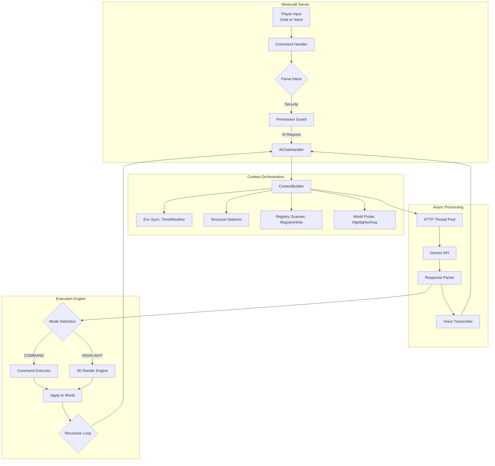

<div align="center">


# 🌌 Gemini AI Companion
### *The Next-Generation Orchestration Layer for Minecraft*

[](https://www.minecraft.net/)
[](https://fabricmc.net/)
[](https://deepmind.google/technologies/gemini/)
[](https://github.com/aaronaalmendarez/gemini-minecraft/releases/tag/v1.1.0)
[](LICENSE)

[**Quick Start**](#-getting-started) • [**Features**](#-pillars-of-intelligence) • [**Roadmap**](#-roadmap) • [**Commands**](#-command-terminal) • [**Technical Specs**](#-the-nerd-stack)

---

### *“The first AI that doesn't just talk to you—it lives in your world.”*


</div>

## ⚡ Quick Try

1.  **Download** the latest release: [**v1.1.0 JAR**](https://github.com/aaronaalmendarez/gemini-minecraft/releases/tag/v1.1.0)
2.  Drop the `.jar` into your **`mods`** folder.
3.  Launch with **Fabric 1.21.1**.
4.  **Experience the Power**:
    *   🎙️ **Hold `V`** and speak naturally (Push-to-Talk).
    *   💬 Type `/chat <your message>` in game.

> *“Build me a small house”*  
> *“Find the nearest village”*

---

## 🎯 Who Is This For?

This project is ideal for:
- **Minecraft Modders**: Experimenting with AI-driven gameplay and orchestration.
- **AI Developers**: Interested in seeing autonomous agents operate within complex sandbox environments.
- **Server Owners**: Looking to add next-level, immersive NPC intelligence to their worlds.
- **Players**: Who want a truly unique, voice-controlled, and narrative-driven Minecraft experience.

---

## 💎 Pillars of Intelligence

Gemini AI Companion isn't just a chatbot. It's a suite of integrated systems that give the AI true digital agency.

### 🎙️ Sensory Intelligence
*The AI perceives your environment in real-time.*
- **Real-Time Voice Transcription**: Issue complex commands via voice audio—transcribed and executed instantly.
- **Structure Awareness**: The AI knows if you’re pillaging a **Bastion**, trading in a **Village**, or exploring an **Ancient City**.
- **Environmental Synchronization**: Deep awareness of server time, weather, dimensions, and nearby entities.

### 🧠 Cognitive Core
*Advanced reasoning that solves complex problems.*
- **Recursive Reasoning**: The AI can reprompt itself to chain multiple steps (e.g., `/locate` → `/tp` → `/give` resources for that biome).
- **Self-Healing Logic**: If a command fails, the AI analyzes the error, updates its logic, and retries automatically (up to 10 stages).
- **Multi-Model Support**: Switch between **Flash**, **Flash-Thinking**, and **Pro** models based on the complexity of your task.

### 🛠️ Modpack Master
*Universal compatibility for the modern player.*
- **Recipe Mastery**: Instantly retrieve complex crafting and smelting paths for **any** item (Vanilla or Modded).
- **Registry Scanner**: Automatically discovers items, blocks, and entity types from your entire modpack via RegistryHints.
- **Undo Engine**: Every AI-driven world mutation can be reverted instantly if it doesn't meet your vision.

### 👁️ Agentic Vision (NEW)
*Image understanding as an active investigation.*
- **Think, Act, Observe Loop**: The model doesn't just "see" a static frame. it formulates plans to inspect specific screen regions and ground responses in visual evidence.
- **Visual Scratchpad**: Uses code execution to analyze pixel-perfect details, ensuring the final answer is based on a deep understanding of the current view.
- **Automated Skill Triggering**: When the AI detects a complex machine or circuit, it automatically triggers relevant scan skills to bridge the gap between "seeing" and "knowing."

### 📍 Physical Agency (v1.1.0)
*The AI interacts with the physical space.*
- **3D World Highlights**: The AI can spawn temporary holographic boxes to "point" at blocks, items, or entities.
- **X-Ray Investigation**: Visual highlights can penetrate walls, allowing the AI to guide you to hidden ores or structures.
- **Dynamic HUD Overlays**: New high-end recording and capturing overlays provide real-time status on voice and vision processes.

### 🛡️ Institutional Guardrails (v1.1.0)
*Enterprise-grade safety and governance.*
- **Multi-Player Permissions**: Granular **Whitelist/Blacklist** system to control who can access the AI.
- **Setup Wizard**: Interactive startup flow to configure API keys, performance modes, and server-wide defaults.
- **Autonomous Configuration**: The AI can analyze server performance and suggest optimal retry limits or model choices.

---

## ✨ Practical Magic: Real-World Scenarios

Stop thinking of it as a "chatbot." Start thinking of it as your **Second Pilot**.

#### 🎙️ Scenario A: The Voice Architect
> **You (Voice):** "I need a small oak starter house right here, and give me some torches."
>
> **Gemini:** *Analyzes location* → Executes `/fill` for the foundation → `/setblock` for walls/roof → `/give @p torch 16` → "Construction complete, and I've provided lighting for your safety."

#### 🧠 Scenario B: The Recursive Scout
> **You:** "I'm lost. Find me a village, take me there, and set my spawn."
>
> **Gemini:** Executes `/locate structure village` → Parses coordinates → Executes `/tp` → Executes `/spawnpoint` → "Welcome to the village. Your spawn is secured."

<details>
<summary><b>Scenario C: The Self-Healing Engineer</b></summary>

> **You:** "Give me a sword with level 10 Sharpness."
>
> **Gemini:** *Attempts old NBT syntax* → **Minecraft returns error** → **Gemini analyzes error** → *Realizes 1.21.1 uses Components* → Re-issues command using `[minecraft:enchantments={levels:{'minecraft:sharpness':10}}]` → **Success.**

</details>

#### 📍 Scenario F: 3D Pointing (v1.1.0)
> **You:** "Where is the nearest diamond ore?"
> 
> > [!TIP]
> > **X-RAY SCAN INITIATED...**
> > ```text
> > [Scan] Found: minecraft:diamond_ore @ -42, 12, 150
> > [Render] Spawning Highlight Box...
> > ```
> > **Gemini:** "I've highlighted a diamond vein through the wall to your left. Dig approximately 12 blocks in that direction."

---

## 🖼️ Visual Exhibit

<details>
<summary><b>View Interface Screenshots</b></summary>

<div align="center">
<br>

### *“Rainbow Thinking” Feedback Interface*
The mod provides real-time, cinematic feedback via an animated action bar.


</div>
</details>

---

## 🚀 Getting Started

### 1. Prerequisites
- **Java 21** & **Fabric Loader** (1.21.1)
- A **Google Gemini API Key** ([Get one here](https://aistudio.google.com/))

### 2. Configuration Wizard (v1.1.0)
1. Drop the `.jar` into your `mods` folder and launch.
2. Type `/chat setup` to begin the interactive configuration wizard.
3. Use `/chat allow <player>` to grant AI access to specific users.

### 3. Connection
Connect your key securely using the in-game terminal:
```bash
/chatkey <your-api-key>
```
> [!TIP]
> Use `/chatkey default <key>` to set a server-wide key for all players.

---

## 🎙️ Voice Control

Gemini AI Companion features a built-in **Push-to-Talk** system for true hands-free interaction.

1. **Press & Hold `V`**: The high-end recording overlay will appear at the top of your screen.
2. **Speak Naturally**: "Build me a small oak house" or "Where is the nearest village?"
3. **Release to Execute**: The mod will instantly transcribe your audio and pass it to the Cognitive Core for processing.

---

## 📟 Command Terminal

| Command            | Description                                                          |
| :----------------- | :------------------------------------------------------------------- |
| `/chat <prompt>`   | Start a conversation (automatically triggers vision/highlights).     |
| `/chat vision`     | Force a screenshot capture and visual analysis of your view.         |
| `/chat setup`      | **Launch Wizard**: Interactive config for keys and permissions.      |
| `/chat allow/deny` | **Guardrails**: Grant or revoke player access (Whitelist/Blacklist). |
| `/chat smarter`    | Force the AI to re-evaluate the last prompt using a **Pro** model.   |
| `/chat undo`       | **Rollback** the last set of AI-executed commands.                   |
| `/chat history`    | Browse previous exchanges in an interactive menu.                    |
| `/chat config`     | Deep-dive into debug mode, sidebar toggles, and retry limits.        |

---

## 🛠️ The Nerd Stack

<details>
<summary><b>📐 System Architecture</b> (Mermaid Diagram)</summary>


</details>

---

## 🗺️ Roadmap

- [x] **AI Vision (Screenshots)**: Visual frame analysis.
- [x] **3D Physical Agency**: World highlights and pointing.
- [x] **Permission Guardrails**: Whitelist/Blacklist management.
- [ ] **Multiplayer-Aware Memory**: Shared AI context between players.
- [ ] **Voice Synthesis (TTS)**: The AI talks back to you.
- [ ] **Plugin API**: Custom behaviors/skills for creators.

---

## 🤝 Contributing

Contributions are what make the open-source community an amazing place to learn, inspire, and create. Please see [CONTRIBUTING.md](CONTRIBUTING.md) for guidelines on how to get started.

---

<div align="center">

### *Elevate your Minecraft experience today.*

[**Download for Fabric**](https://fabricmc.net/) | [**Report a Bug**](https://github.com/aaronaalmendarez/gemini-minecraft/issues)

---

### *Built with ❤️ for the Minecraft Community*

</div>
