<div align="center">

# 🤖 Gemini AI Companion

### Talk to Minecraft. AI Understands.

[](https://minecraft.net)
[](https://fabricmc.net)
[](https://ai.google.dev)
[](LICENSE)

**The most powerful AI mod for Minecraft. Ask questions, execute commands, and control your game using natural language.**

[Getting Started](#-getting-started) •
[Features](#-features) •
[Commands](#-commands) •
[Configuration](#%EF%B8%8F-configuration)

</div>

---

## ✨ Features

| Feature                         | Description                                                                         |
| ------------------------------- | ----------------------------------------------------------------------------------- |
| 🗣️ **Natural Language Commands** | Say "give me a diamond sword with sharpness 5" instead of memorizing command syntax |
| 🧠 **Three AI Modes**            | ASK (questions), PLAN (strategies), COMMAND (execute actions)                       |
| 🔄 **Self-Healing Commands**     | AI automatically fixes and retries failed commands up to 10 times                   |
| 🌐 **Web Search**                | AI can search the web for Minecraft info using Google Grounding                     |
| 📊 **Live Sidebar**              | Real-time stats: tokens used, response time, current mode                           |
| ↩️ **Undo Support**              | Made a mistake? `/chat undo` reverses the last AI actions                           |
| 💾 **Chat History**              | Export conversations to TXT or JSON                                                 |
| ⚙️ **In-Game Config GUI**        | Press `G` to open settings (keybind configurable)                                   |
| 🎨 **Visual Feedback**           | Rainbow thinking animation, particles, and sound effects                            |

---

## 🚀 Getting Started

### Prerequisites
- Minecraft 1.21.1
- [Fabric Loader](https://fabricmc.net/use/installer/) 0.16.0+
- [Fabric API](https://modrinth.com/mod/fabric-api)
- [Gemini API Key](https://aistudio.google.com/apikey) (free)

### Installation

1. Download the latest release from [Releases](../../releases)
2. Place the `.jar` in your `mods` folder
3. Launch Minecraft with Fabric
4. Set your API key:
   ```
   /chatkey YOUR_API_KEY_HERE
   ```
5. Start chatting:
   ```
   /chat give me a diamond pickaxe with efficiency 5
   ```

---

## 💬 Commands

### Core Commands

| Command           | Description                           |
| ----------------- | ------------------------------------- |
| `/chat <message>` | Send a message to the AI              |
| `/chat clear`     | Clear conversation history            |
| `/chat cancel`    | Cancel the current AI request         |
| `/chat undo`      | Undo the last AI-executed commands    |
| `/chat smarter`   | Re-run last prompt with the Pro model |

### History & Export

| Command                 | Description                     |
| ----------------------- | ------------------------------- |
| `/chat history`         | Show recent conversations       |
| `/chat history all`     | Show full history               |
| `/chat export 10 txt`   | Export last 10 exchanges to TXT |
| `/chat export all json` | Export full history to JSON     |

### Context Commands

| Command                    | Description                               |
| -------------------------- | ----------------------------------------- |
| `/chat skill inventory`    | Include your inventory in AI context      |
| `/chat skill nearby`       | Include nearby entities in context        |
| `/chat skill stats`        | Include player stats (health, hunger, XP) |
| `/chat skill nbt mainhand` | Include NBT data of held item             |

---

## ⚙️ Configuration

### In-Game GUI
Press **`G`** to open the config screen (keybind configurable in Controls).

### Command-Based Config

```bash
/chat config                    # Show all settings
/chat config model flash        # Set AI model (flash/flash-thinking/pro/auto)
/chat config retries 5          # Set command retry limit (0-10)
/chat config sidebar on         # Toggle sidebar stats
/chat config sounds off         # Toggle sound effects
/chat config particles minimal  # Set particle level (on/minimal/off)
/chat config debug on           # Show executed commands
```

### API Key Management

| Command                  | Description                   |
| ------------------------ | ----------------------------- |
| `/chatkey <key>`         | Set your personal API key     |
| `/chatkey clear`         | Remove your API key           |
| `/chatkey default <key>` | Set server-wide default key   |
| `/chatkey info`          | Show key configuration status |

You can also set the `GEMINI_API_KEY` environment variable.

---

## 🎯 AI Models

| Model              | Best For                                  | Speed      |
| ------------------ | ----------------------------------------- | ---------- |
| **Flash**          | Quick commands, simple questions          | ⚡ Fastest  |
| **Flash Thinking** | Complex reasoning, multi-step tasks       | ⚡ Fast     |
| **Pro**            | Difficult problems, detailed explanations | 🐢 Slower   |
| **Auto**           | Automatically selects based on task       | ⚡ Adaptive |

---

## 📝 Examples

```bash
# Items & Equipment
/chat give me full netherite armor with protection 4
/chat give me a bow with infinity and power 5

# World Interaction
/chat teleport me to the nearest village
/chat what biome am I in?
/chat make it stop raining

# Combat & Entities
/chat kill all zombies within 50 blocks
/chat spawn 5 wolves and tame them

# Complex Commands
/chat create a 10x10 glass dome around me
/chat give all players speed 2 for 5 minutes

# Questions
/chat how do I find diamonds in 1.21?
/chat what does a smithing template do?
```

---

## 🔧 Technical Details

- **Minecraft Version:** 1.21.1
- **Mod Loader:** Fabric
- **API:** Google Gemini (gemini-3.0-flash, gemini-3.0-pro)
- **Commands:** Execute at OP level 4
- **Data Storage:** `run/ai-keys/` (API keys), `run/chat-logs/` (exports)

---

## 📄 License

MIT License - see [LICENSE](LICENSE) for details.

---

<div align="center">

**Made with ❤️ for the Minecraft community**

[⬆ Back to Top](#-gemini-ai-companion)

</div>

---

# 📚 Technical Report: Architecture & Implementation

This section documents the engineering techniques that enable seamless AI-to-game collaboration.

## System Architecture


## Request Lifecycle


## Self-Healing Command Retry

The mod implements an intelligent retry mechanism that feeds command errors back to Gemini:


**Example Retry Flow:**
1. AI generates: `/give @p diamond_sword{Enchantments:[{id:sharpness,lvl:5}]}`
2. Server rejects: "Unknown argument: Enchantments" (1.21.1 uses components)
3. Error fed back to Gemini with context
4. AI corrects: `/give @p diamond_sword[enchantments={levels:{sharpness:5}}]`
5. Command succeeds

## Context Window Management


| Component           | Strategy                                             |
| ------------------- | ---------------------------------------------------- |
| **System Prompt**   | Static instructions for Minecraft command generation |
| **Player Context**  | Dynamically injected: inventory, position, stats     |
| **Chat History**    | Rolling window of last 10 exchanges, FIFO eviction   |
| **Response Buffer** | Reserved tokens to prevent truncation                |

## Thread Safety Model


**Key Techniques:**
- `ConcurrentHashMap` for all player-specific state
- `server.execute()` to marshal world mutations back to main thread
- `CompletableFuture` for non-blocking API calls
- Atomic operations for sidebar updates

## Undo System Architecture

```mermaid
stateDiagram-v2
    [*] --> Idle
    Idle --> Executing: /chat command
    Executing --> Recording: Command succeeds
    Recording --> Idle: Push to undo stack
    Idle --> Reverting: /chat undo
    Reverting --> Idle: Execute inverse commands
    
    note right of Recording
        Captures:
        - Entity spawns → /kill
        - Item gives → /clear
        - Effects → /effect clear
    end note
```



## Data Flow Summary

| Layer             | Technology               | Purpose                      |
| ----------------- | ------------------------ | ---------------------------- |
| **Input**         | Brigadier Commands       | Type-safe command parsing    |
| **Network**       | java.net.http.HttpClient | Async HTTP/2 to Gemini       |
| **Serialization** | Gson                     | JSON encoding/decoding       |
| **State**         | ConcurrentHashMap        | Thread-safe player data      |
| **Execution**     | CommandManager           | Server-side command dispatch |
| **Feedback**      | Scoreboard API           | Real-time sidebar stats      |

## Performance Characteristics

| Metric              | Typical Value                 |
| ------------------- | ----------------------------- |
| API Latency         | 200-800ms (Flash), 1-3s (Pro) |
| Memory per Player   | ~50KB (history + state)       |
| Retry Overhead      | +200ms per attempt            |
| Sidebar Update Rate | Every 20 ticks (1 second)     |

---

> **Note:** This architecture prioritizes responsiveness and reliability. The async design ensures the game never freezes during API calls, while the retry system handles the inherent unpredictability of LLM outputs.
